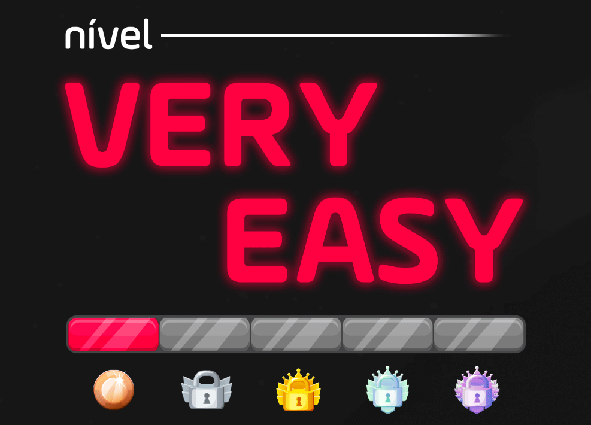

# Série de Desafios de Programação

Bem-vindo à série de desafios de programação! Esta coleção de desafios foi projetada para ajudar a aprimorar suas habilidades de codificação com problemas variados e interessantes. Cada desafio oferece uma oportunidade para praticar e aprender novas técnicas, ideal para desenvolvedores iniciantes e intermediários.

## Introdução

Os desafios nesta série foram criados para serem acessíveis e educativos. Eles cobrem uma gama de tópicos e conceitos, incluindo manipulação de arrays, processamento de strings, cálculos matemáticos, e mais. Ao completar esses desafios, você terá a chance de melhorar suas habilidades em JavaScript e outros aspectos fundamentais da programação.

### Desafios Incluídos:

1. **Cadastro de Alunos**: Gerencie o cadastro de alunos, adicione notas e calcule a média das notas.
2. **Gerar Chunks**: Crie uma string de "chunks" separados por hífen com base em um número fornecido.
3. **Inverter Array**: Inverta a ordem dos números em um array fornecido pelo usuário.
4. **Quadrado dos Algarismos**: Calcule o quadrado de cada algarismo de um número fornecido.
5. **Maior Letra em Ordem Alfabética**: Encontre a maior letra em uma string fornecida.
6. **Palavras Invertidas**: Inverta cada palavra em uma string fornecida.

## Missões detalhadas

1. **Para obter mais detalhes sobre cada missão e tentar realizá-las você mesmo, acesse esse PDF**:
[Visualizar PDF](https://drive.google.com/file/d/1bB1D4XzLE7JAXpqr9YowRFH0F7ADmcuu/view?usp=drive_link)